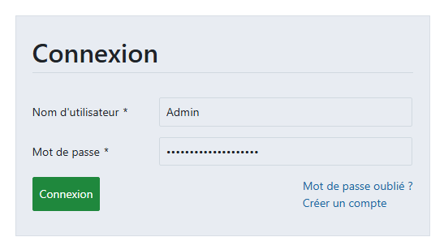
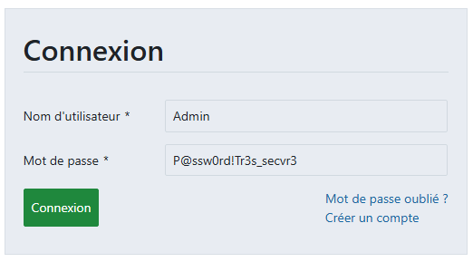

It can happen during a pentest that a seemingly protected password field is only masked on the client side, while the actual value remains accessible within the DOM. This repository demonstrates a simple yet illustrative scenario where a prefilled password, hidden behind type="password", can be exposed by inspecting and modifying the HTML through browser developer tools.

  # Demo #

As you can see, there is no way to see the password or copy‑paste it because it is masked by the browser using the **type="password"** attribute, and the UI prevents direct selection or contextual‑menu access to the field.

To bypass this just press F12 to open the DevTools and find or select the field password :

Now you just have to change *type="password"* to *type="text"* and TADAA

  # Impact / Lessons learned #

This simple manipulation highlights that client‑side masking is purely cosmetic and does not protect the secret from an attacker with access to the browser or the DOM. Even if the UI prevents copying or selection, the password still exists in the page’s HTML and can be revealed through basic inspection.

  # Remediation #

- Avoid pre‑filling real passwords or secrets into input fields on the client side.
- If a value must be shown, let the user explicitly reveal it through a controlled toggle, and never store sensitive credentials in the DOM.
- Restrict the use of autocomplete and browser password managers for sensitive internal credentials.
