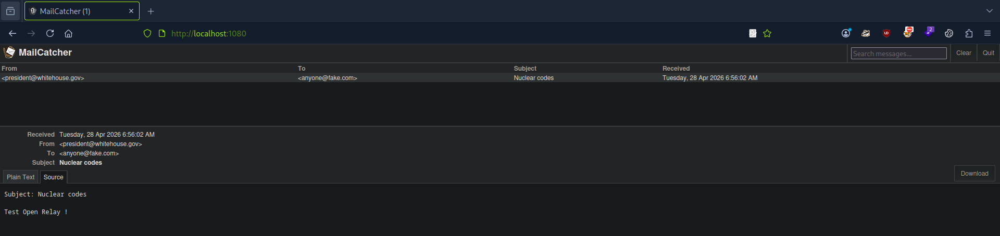

An **SMTP Open Relay** is a mail server that accepts and forwards messages from arbitrary senders to arbitrary recipients without requiring proper authorization. In a real environment, this misconfiguration can be abused for spam, phishing, and spoofed email delivery.  

This lab demonstrates the behavior in a **controlled Docker environment** for **educational and authorized testing only**

## Goal

Demonstrate that a mail server can accept emails from a forged sender and relay them without authentication.


## Requirements

- Docker installed
- `telnet` or `nc`
- A local lab environment


## Lab setup

Pull and run the vulnerable SMTP relay container:

```
docker pull mwaeckerlin/smtp-relay:latest
docker run -d --name smtp-open-relay -p 25:25 mwaeckerlin/smtp-relay
```


Expected result:

- A container named `smtp-open-relay` is running
- Port `25/tcp` is exposed on the host


## Manual demonstration

Connect to the SMTP service:

```
telnet 127.0.0.1 25
```

Then send the following SMTP commands **line by line**:

```
HELO attacker.com
MAIL FROM: <president@whitehouse.gov>
RCPT TO: <anyone@fake.com>
DATA
Subject: Nuclear codes

Test Open Relay !
.
QUIT
```

If the server accepts the sender and recipient without authentication, it demonstrates relay behavior. 

We can see the mail below



## Detection in a pentest

You can test for relay behavior with Nmap:

```
┌─[eu-dedivip-1]─[10.10.15.165]─[ys4@htb-ctu79dbjuq]─[~]
└──╼ [★]$ sudo nmap -p25 --script smtp-open-relay 127.0.0.1
Starting Nmap 7.94SVN ( https://nmap.org ) at 2026-04-28 07:07 CDT
Nmap scan report for localhost (127.0.0.1)
Host is up (0.000053s latency).

PORT   STATE SERVICE
25/tcp open  smtp
|_smtp-open-relay: Server is an open relay (16/16 tests)

Nmap done: 1 IP address (1 host up) scanned in 0.19 seconds
```

Or with Metasploit:

```
┌─[eu-dedivip-1]─[10.10.15.165]─[ys4@htb-ctu79dbjuq]─[~]
└──╼ [★]$ msfconsole -q
[msf](Jobs:0 Agents:0) >> use auxiliary/scanner/smtp/smtp_relay
[msf](Jobs:0 Agents:0) auxiliary(scanner/smtp/smtp_relay) >> set RHOSTS 127.0.0.1
RHOSTS => 127.0.0.1
[msf](Jobs:0 Agents:0) auxiliary(scanner/smtp/smtp_relay) >> run
[+] 127.0.0.1:25          - SMTP 220 13e1edbcb54c.localdomain ESMTP\x0d\x0a
[+] 127.0.0.1:25          - Potential open SMTP relay detected: - MAIL FROM:<sender@example.com> -> RCPT TO:<target@example.com>
[*] 127.0.0.1:25          - Scanned 1 of 1 hosts (100% complete)
[*] Auxiliary module execution completed
```

***

## Indicators of a successful demo

Typical signs that the relay behavior is exposed:

- The server accepts `MAIL FROM` without authentication
- The server accepts `RCPT TO` for a non-local sender
- The SMTP conversation continues without immediate rejection
- Tools such as Nmap or Metasploit identify relay capability


## Security impact

An exposed SMTP Open Relay can be abused for:

- Spam distribution
- Phishing campaigns
- Sender spoofing
- Reputation damage and blacklisting


## Remediation

To prevent SMTP Open Relay issues:

- Require SMTP authentication
- Restrict relay access to trusted networks only
- Reject unauthorized destination domains
- Monitor mail logs for abnormal relay activity
- Apply secure Postfix/Exim/Sendmail relay restrictions

## To go further : Swaks (Swiss Army Knife SMTP)

```
┌─[eu-dedivip-1]─[10.10.15.165]─[ys4@htb-ctu79dbjuq]─[~]
└──╼ [★]$ swaks --to anyone@fake.com --from president@whitehouse.gov --server 127.0.0.1:1025 --header "Subject: TEST" --body "Message capturé !"
=== Trying 127.0.0.1:1025...
=== Connected to 127.0.0.1.
<-  220 EventMachine SMTP Server
 -> EHLO htb-ctu79dbjuq
<-  250-Ok EventMachine SMTP Server
<-  250-NO-SOLICITING
<-  250 SIZE 20000000
 -> MAIL FROM:<president@whitehouse.gov>
<-  250 Ok
 -> RCPT TO:<anyone@fake.com>
<-  250 Ok
 -> DATA
<-  354 Send it
 -> Date: Tue, 28 Apr 2026 07:11:31 -0500
 -> To: anyone@fake.com
 -> From: president@whitehouse.gov
 -> Subject: TEST
 -> Message-Id: <20260428071131.037956@htb-ctu79dbjuq>
 -> X-Mailer: swaks v20201014.0 jetmore.org/john/code/swaks/
 -> 
 -> Message capturé !
 -> 
 -> 
 -> .
<-  250 Message accepted
 -> QUIT
<-  221 Ok
=== Connection closed with remote host.
```
